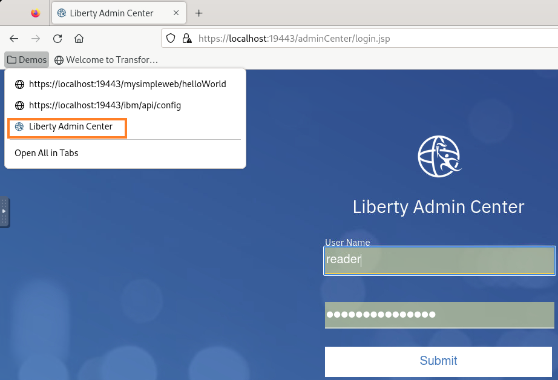
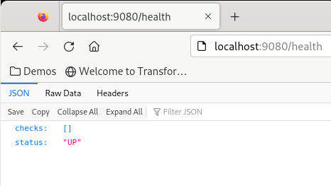

# Liberty Getting Started Demos

Work in progress

 

**Last updated:** March 2024

**Duration:** Depens on what you want to demo

Need support? Contact **Lars Besselmann**

## 1. Introduction

In the document, you will find some hints how to use the asset for customer demos in the area of 

* Liberty 
    * Liberty Tools with configuration and code assistant
    * Liberty AdminCenter
* Transformation Advisor
    * Basic analysis
    * Common Code
* Mono2Micro

## 2. Accessing the environment

To reserve an environment for the demo, you can obtain one here. 
<https://techzone.ibm.com/collection/libery-getting-started-labs> 

Go to the tab **environment** and select the environment.

<kbd></kbd>

 Follow the on-screen instructions for the “**Reserve now**” option.

The lab environment contains one (1) Linux VM, named Workstation.

<kbd></kbd>

 

1.  Access the lab environment from your web browser. 
     
    A `Published Service` is configured to provide access to the **`Workstation`** VM through the noVNC interface for the lab environment.
    
    a. When the demo environment is provisioned, click on the **`environment tile`** to open its details view. 

    b. Click on the **`Published Service`** link which will display a **Directory listing**  
    
    c. Click on the **`vnc.html`** link to open the lab environment through the **noVNC** interface. 
    
    <kbd></kbd>
    
    d. Click the **`Connect`** button 
    
      <kbd></kbd>

    e. Enter the password as:  **`IBMDem0s!`**. Then click the **`Send Credentials`** button to access the lab environment. 

    > Note: That is a numeric zero in passw0rd  

      <kbd></kbd>

	 
	  
	 
2.  If prompted to Login to the "workstation" VM, use the credetials below: 

    The login credentials for the **workstation”** VM is:
 
     - User ID: **techzone**

     - Password: **IBMDem0s!**

     > Note: That is a numneric zero in the password

	  
 
     <kbd></kbd>
	 
	  

## 3. Tips for working in the lab environment     

1. You can resize the viewable area using the **noVNC Settings** options to resize the virtual desktop to fit your screen.

    a. From the environemnt VM, click on the **twisty** on the noNC control pane to open the menu.  

    <kbd></kbd>

    b. To increase the visible area, click on `Settings > Scaling Mode` and set the value to `Remote Resizing`
      
     <kbd></kbd>

2.  You can copy / paste text from the lab guide into the lab environment using the clipboard in the noVNC viewer. 
   
    a. Copy the text from the lab guide that you want to paste into the lab environment
    
    b. Click the **`Clipboard`** icon and **`paste`** the text into the noVNC clipboard

    <kbd></kbd>
    
    c. Paste the text into the VM, such as to a terminal window, browser window, etc. 

    d. Click on the **`clipboard`** icon again to close the clipboard

   
3. An alternative to using the noVNC Copy / Paste option, you may consider opening the lab guide in a web browser inside of the VM. Using this method, you can easily copy / paste text from the lab guide without having to use the noVNC clipboard. 

4. To switch between different windows or get access the tool bar, click on the **`Activities`** icon within the VM.

    <kbd></kbd>

    Then select from the tool bar the application that you want to open. In the lab, you will use Firefox and the terminal.

    <kbd></kbd>
    

5. How to change the background color 
In the environment, the default background for terminal windows and Visual Studio Code is dark. For the lab documentation, we changed the color to light. Feel free to keep the background in light but if you want to change it to dark, here the explanation how it was changed.

    1. How to change the terminal background to white
        Right-click into the terminal background, then select Preferences.

        <kbd></kbd>

        A Preferences window opens. Click on Colors, then uncheck the box for  Use colors from system theme . (If you want to get back to dark, check the box again).

        <kbd></kbd>

        The terminal background should switch to white.

        <kbd></kbd>

        Close the Preferences window.

    2. How to switch the background of Visual Studio Code from dark to light

        In a terminal Window, run the following command to start Visual Studio Code

            mkdir ~/temp
            code ~/temp

        <kbd></kbd>

        Visual Studio Code opens with a dark background. 
        Click on  Yes, I trust the authors 

        <kbd></kbd>

        Then select Preferences > Theme > Color Theme

        <kbd></kbd>

        Select Light

        <kbd></kbd>

        The tool will change to a light background, see below.

        <kbd></kbd>

        Close Visual Studio Code.

     

## 4. Installed software

* Installed software
    * WebSphere Liberty 24.0.0.1 ILAN
    * IBM Transformation Advisor 1.9.0 installed into /home/techzone/transformation-advisor-local-3.9.0
    * IBM Mono2Micro version: 23.0.09.0  installed into cd /home/techzone/mono2micro-CLI/
    * Visual Studio Code with the Liberty Tools Plugin
    * IBM Semeru Runtime Open Edition 17.0.8.1 
    * maven 3.5.3
    * docker 24.0.7
    * git 2.39.3
* Demo-Assets
    * These are located in the sub-folders of ~/demos

## 5. How to use the environment for demos

## 5.1 Liberty Administration

1. Open a terminal window and navigate to the directory ~/demos/TA

        cd ~/demos/Liberty

2. In the directory, you will find several files and directories

    - directories
        - wlp - WebSphere Liberty 24.0.0.1 ILAN binaries
        - wlp_usr - WLP server diretory with server myServer
    - configuration files
        - adminCenter-config.xml - configuration file to enable the adminCenter
        - rest-config.xml - configuration file to enable the REST APIs
        - jvm.options, bootstrap.properties, loglevel-config.xml - additional optional configuration files

### 5.1.1 Demonstrate the Admin Center

1. In the terminal, start Liberty via command
        
        cd ~/demos/Liberty
        wlp/bin/server start myServer

2. Copy the adminCenter configuration into the dropins folder
        cp adminCenter-config.xml wlp_usr/servers/myServer/configDropins/overrides/adminCenter-config.xml

    <table>
    <tbody>
    <tr class="odd">
    <td><kbd></kbd></td>
    <td>
    
If you want to demonstrate dynamic configuration, run the following tail command in a second terminal window while doing the copy:   <strong>tail -f wlp_usr/servers/myServer/logs/messages.log</strong></td>
    </tr>
    </tbody>
    </table>

3. Access the Liberty Admin Center via Firefox bookmark or the URL **https://localhost:19443/adminCenter**.

    <kbd></kbd>

4. Log in as user **reader** with password **Liberty4Readers** or user **admin** with password **Liberty4Admins** and press **Submit**.

5. To get an idea what you can demo in the AdminCenter, take a look at the lab https://github.com/LarsBesselmann/LibertyGettingStarted-Lab

### 5.1.2 Liberty REST APIs

1. In the terminal, start Liberty (if not already started) via command
        
        cd ~/demos/Liberty
        wlp/bin/server start myServer

2. Copy the adminCenter configuration into the dropins folder
        cp rest-config.xml wlp_usr/servers/myServer/configDropins/overrides/rest-config.xml

    <table>
    <tbody>
    <tr class="odd">
    <td><kbd></kbd></td>
    <td>
    
If you want to demonstrate dynamic configuration, run the following tail command in a second terminal window while doing the copy:   <strong>tail -f wlp_usr/servers/myServer/logs/messages.log</strong></td>
    </tr>
    </tbody>
    </table>

3. Access the Liberty REST APIs via Firefox bookmark or the URL **https://localhost:19443/ibm/api/config**.

    <kbd></kbd>

4. If you configured the AdminCenter as well, log in as user **reader** with password **Liberty4Readers** or user **admin** with password **Liberty4Admins**. Otherwise log in as uer **admin** with password **LibertyIsGreat**.

5. To get an idea what you can demo in the AdminCenter, take a look at the lab https://github.com/LarsBesselmann/LibertyGettingStarted-Lab

## 5.2 Liberty Tools

1. Open a terminal window and unzip the starter project from the backup directory
        
        mkdir ~/demos/simpleweb
        unzip backup/Liberty-Getting-Started/simpleweb.zip -d ~/demos/simpleweb
        cd ~/demos/simpleweb
        
2. Start Visual Studio Code by executing in the terminal the following command

        code .

3. If asked, trust the author and ignore/close all pop-ups telling to install updates and so on.

4. Use the Liberty Dashboard to start Liberty in Dev Mode

    <kbd></kbd>

5. Now you have different toptions:

    - Use the **Liberty Configuration Assistant**

        1. Navigate to the server.xml

            <kbd></kbd>
    
        2. To get an idea how to use the configuration assistant, take a look at the lab https://github.com/LarsBesselmann/LibertyGettingStarted-Lab

    - Use the **Liberty code assistant for Jakarte EE** to create a new servlet

        1. Create a new file called helloWorldServlet.java.

            <kbd></kbd>
            <kbd></kbd>

        2. To get an idea how to use the code assistant, take a look at the lab https://github.com/LarsBesselmann/LibertyGettingStarted-Lab

    - Use the **Liberty code assistant for MicroProfile** to create a simple health policy
        1. Open a browser and check the already available health policies via URL localhost:9080/health

            <kbd></kbd>

        2. Create a file called myHealth.java

            <kbd></kbd>

        3. Delete the generated content in the file, then type **mp**. The code assistant will offer to craeet a microProfile health policy.

            <kbd></kbd>

        4. Select microprofilereadiness and the code gets generated. As you are running Liberty in Dev Mode, the code will get compiled and deployed.

        5. Go back to the browser and click reload on the URL localhost:9080/health. You should see the new policy.

            <kbd></kbd>

    - To get an idea what else to demo, take a look at the lab https://github.com/LarsBesselmann/LibertyGettingStarted-Lab

## 5.3 IBM Transformation Advisor
1. Open a terminal window and navigate to the directory ~/demos/TA

        cd ~/demos/TA

2. In the directory, you will find several files

    - Scripts to prepare the demo
        - startTA.sh - to start Transformation Advisor
        - loadTA_bulk.sh - to load a bulk of collections to TA
        - stopTA.sh - to stop Transformation Advisor
    - Demo collections
        - bulk_data_3.zip - a set of collections including ACME and others - good to demo TA including common code and guidance, used in the TA-CC lab
        - AppSrv01-3.8.1.zip - a collection with Modresorts, CustomerOrderServices and more - this collection is used in the TA lab
        - Dmgr01_RHEL7WAS2.zip - a collection with Modresorts, Daytrader and WebSphere Bank, good to demo cluster migration and operational considerations
        - Other collections 
    
2. Start IBM Transformation Advisor via command

        ./startTA.sh

   Wait until TA has started. The Transformation Advisor UI will be available via browser at port:3000

3. The Transformation Advisor does not have any workspace defined so far. You have now different options:
    - Upload the bulk zip which contains several collections
    - Upload an individual collection
    - Use a combination of bulk and individual collections

### 5.2.1 Upload the bulk zip which contains several collections

1. Upload the bulk collection to IBM Transformation Advisor via command

        ./loadTA_bulk.sh

2. Wait until the bulk collection has been uploaded.

3. Open Firefox and access the Transformation Advisor UI via the bookmark 

    <kbd></kbd>

4. Access the automatically created workspace

    <kbd></kbd>

5. Demonstrate the assessment of the different applications.  
    To get an understanding what you could demo, take a look at the lab https://github.com/LarsBesselmann/Liberty-Getting-Started-TA-CC

### 5.2.2 Upload one or more individual collections

1. Open Firefox and access the Transformation Advisor UI via the bookmark 

    <kbd></kbd>

2. Create a workspace

3. Upload the collection of choice. If you do not have much experience with TA, use AppSrv01-3.8.1.zip. 

4. Demo TA using the uploaded collection

    - To get an understanding what you could demo with the collection AppSrv01-3.8.1.zip, take a look at the lab https://github.com/LarsBesselmann/Liberty-Getting-Started-TA

    - If you used the collection Dmgr01_RHEL7WAS2.zip, you will be able to demo cluster migration and will see operational considerations in the inventory report.

        <kbd></kbd>
        
        <kbd></kbd>

        <kbd></kbd>

- To get an idea what else to demo, take a look at the labs https://github.com/LarsBesselmann/Liberty-Getting-Started-TA and https://github.com/LarsBesselmann/Liberty-Getting-Started-TA-CC.

## 5.4 IBM Mono2Micro
1. Open a terminal window and navigate to the directory ~/demos/TA

        cd ~/demos/M2M

2. In the directory, you will find two folders

    - example - current mono2micro example shipped with mono2micro
    - DayTrader_2023_V1 - older mono2micro example used to demo refactoring options
    
3. Start IBM Mono2Micro via command

        cd /home/techzone/mono2micro-CLI/
        ./mono2micro workbench -p 3005

   Comment: Use port 3005 to not conflict with a running Transformation Advisor

3. Open Firefox and access the Mono2Micro via URL localhost:3005 

4. Load the json file of choice, for example
    - /home/techzone/demos/M2M/example/daytrader/mono2micro-analysis-custom/oriole/final_graph.json
      or
    - /home/techzone/demos/M2M/DayTrader_2023_V1/final_graph_Lars.json
    
- To get an idea what to demo, take a look at the lab https://github.com/LarsBesselmann/Liberty-Getting-Started-M2M.