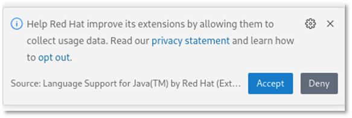
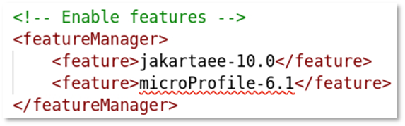
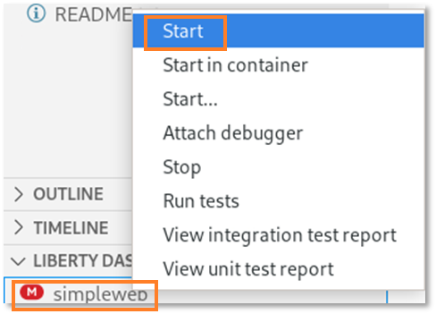
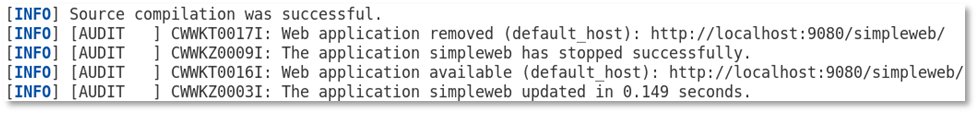
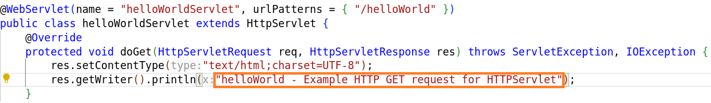
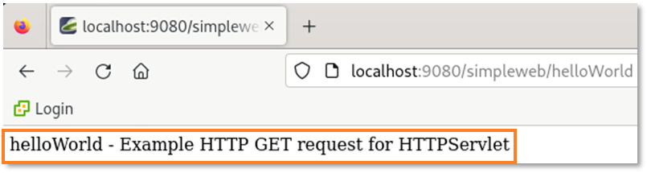

# Liberty Getting Started Demos

Work in progress

 

**Last updated:** March 2024

**Duration:** Depens on what you want to demo

Need support? Contact **Lars Besselmann**

## 1. Introduction

In the document, you will find some hints how to use the asset for customer demos in the area of 

* Liberty 
    * Liberty Tools with configuration and code assistant
    * Liberty AdminCenter
* Transformation Advisor
    * Basic analysis
    * Common Code
* Mono2Micro

## 2. Accessing the environment

To reserve an environment for the demo, you can obtain one here. 
<https://techzone.ibm.com/collection/libery-getting-started-labs> 

Go to the tab **environment** and select the environment.

<kbd></kbd>

 Follow the on-screen instructions for the “**Reserve now**” option.

The lab environment contains one (1) Linux VM, named Workstation.

<kbd></kbd>

 

1.  Access the lab environment from your web browser. 
     
    A `Published Service` is configured to provide access to the **`Workstation`** VM through the noVNC interface for the lab environment.
    
    a. When the demo environment is provisioned, click on the **`environment tile`** to open its details view. 

    b. Click on the **`Published Service`** link which will display a **Directory listing**  
    
    c. Click on the **`vnc.html`** link to open the lab environment through the **noVNC** interface. 
    
    <kbd></kbd>
    
    d. Click the **`Connect`** button 
    
      <kbd></kbd>

    e. Enter the password as:  **`IBMDem0s!`**. Then click the **`Send Credentials`** button to access the lab environment. 

    > Note: That is a numeric zero in passw0rd  

      <kbd></kbd>

	 
	  
	 
2.  If prompted to Login to the "workstation" VM, use the credetials below: 

    The login credentials for the **workstation”** VM is:
 
     - User ID: **techzone**

     - Password: **IBMDem0s!**

     > Note: That is a numneric zero in the password

	  
 
     <kbd></kbd>
	 
	  

## 3. Tips for working in the lab environment     

1. You can resize the viewable area using the **noVNC Settings** options to resize the virtual desktop to fit your screen.

    a. From the environemnt VM, click on the **twisty** on the noNC control pane to open the menu.  

    <kbd></kbd>

    b. To increase the visible area, click on `Settings > Scaling Mode` and set the value to `Remote Resizing`
      
     <kbd></kbd>

2.  You can copy / paste text from the lab guide into the lab environment using the clipboard in the noVNC viewer. 
   
    a. Copy the text from the lab guide that you want to paste into the lab environment
    
    b. Click the **`Clipboard`** icon and **`paste`** the text into the noVNC clipboard

    <kbd></kbd>
    
    c. Paste the text into the VM, such as to a terminal window, browser window, etc. 

    d. Click on the **`clipboard`** icon again to close the clipboard

   
3. An alternative to using the noVNC Copy / Paste option, you may consider opening the lab guide in a web browser inside of the VM. Using this method, you can easily copy / paste text from the lab guide without having to use the noVNC clipboard. 

4. To switch between different windows or get access the tool bar, click on the **`Activities`** icon within the VM.

    <kbd></kbd>

    Then select from the tool bar the application that you want to open. In the lab, you will use Firefox and the terminal.

    <kbd></kbd>
    

## 4. Installed software

* Installed software
    * WebSphere Liberty 24.0.0.1 ILAN
    * IBM Transformation Advisor 1.9.0 installed into /home/techzone/transformation-advisor-local-3.9.0
    * IBM Mono2Micro version: 23.0.09.0  installed into cd /home/techzone/mono2micro-CLI/
    * Visual Studio Code with the Liberty Tools Plugin
    * IBM Semeru Runtime Open Edition 17.0.8.1 
    * maven 3.5.3
    * docker 24.0.7
    * git 2.39.3
* Demo-Assets
    * These are located in the sub-folders of ~/demos

## 5. How to use the environment for demos

## 5.1 Liberty Administration

A Liberty instance is installed and can be used to demo Liberty capabilities like
- Dynamic Updates (use the provided configuration snippets for AdminCenter or LogLevel for demonstration)
- Portable Configuration (open the server.xml file to explain concepts like includes and variables)
- AdminCenter
- REST APIs
- Zero Migration and Feature Installation

2. In the directory ~/demos/Liberty, you will find several files and directories

    - directories
        - wlp - WebSphere Liberty 24.0.0.1 ILAN binaries
        - wlp_usr - WLP user directory with server myServer
    - configuration files
        - adminCenter-config.xml - configuration file to enable the adminCenter
        - rest-config.xml - configuration file to enable the REST APIs
        - jvm.options, bootstrap.properties, loglevel-config.xml - additional optional configuration files

### 5.1.1 Demonstrate the Admin Center

1. In the terminal, start Liberty via command
        
        cd ~/demos/Liberty
        wlp/bin/server start myServer

2. Copy the adminCenter configuration into the dropins folder
        cp adminCenter-config.xml wlp_usr/servers/myServer/configDropins/overrides/adminCenter-config.xml

    <table>
    <tbody>
    <tr class="odd">
    <td><kbd></kbd></td>
    <td>
    
If you want to demonstrate dynamic configuration, run the following tail command in a second terminal window while doing the copy:   <strong>tail -f wlp_usr/servers/myServer/logs/messages.log</strong></td>
    </tr>
    </tbody>
    </table>

3. Access the Liberty Admin Center via Firefox bookmark or the URL **https://localhost:19443/adminCenter**.

    <kbd></kbd>

4. Log in as user **reader** with password **Liberty4Readers** or user **admin** with password **Liberty4Admins** and press **Submit**.

5. To get an idea what you can demo in the AdminCenter, take a look at the lab https://github.com/LarsBesselmann/LibertyGettingStarted-Lab

### 5.1.2 Liberty REST APIs

1. In the terminal, start Liberty (if not already started) via command
        
        cd ~/demos/Liberty
        wlp/bin/server start myServer

2. Copy the adminCenter configuration into the dropins folder
        cp rest-config.xml wlp_usr/servers/myServer/configDropins/overrides/rest-config.xml

    <table>
    <tbody>
    <tr class="odd">
    <td><kbd></kbd></td>
    <td>
    
If you want to demonstrate dynamic configuration, run the following tail command in a second terminal window while doing the copy:   <strong>tail -f wlp_usr/servers/myServer/logs/messages.log</strong></td>
    </tr>
    </tbody>
    </table>

3. Access the Liberty REST APIs via Firefox bookmark or the URL **https://localhost:19443/ibm/api/config**.

    <kbd></kbd>

4. If you configured the AdminCenter as well, log in as user **reader** with password **Liberty4Readers** or user **admin** with password **Liberty4Admins**. Otherwise log in as uer **admin** with password **LibertyIsGreat**.

5. To get an idea what you can demo in the AdminCenter, take a look at the lab https://github.com/LarsBesselmann/LibertyGettingStarted-Lab

## 5.1.3 Demonstrate Zero Migration and FeatureInstall

1. Stop Liberty if running

        ~/demos/Liberty/wlp/bin/server stop myServer

2. List Liberty servers

        ~/demos/Liberty/wlp/bin/server list

3. Start Liberty and take a look at the output - it should show Liberty 24.0.0.1

        ~/demos/Liberty/wlp/bin/server run myServer

4. Stop the server by pressing **CTRL+C**

5. Download a new version via the following command:

        wget https://public.dhe.ibm.com/ibmdl/export/pub/software/websphere/wasdev/downloads/wlp/24.0.0.3/wlp-kernel-24.0.0.3.zip -P ~/Downloads

6. Extract the Liberty archive into a new directory called work

        mkdir ~/work
        unzip ~/Downloads/wlp-kernel-24.0.0.3.zip -d ~/work

7. Set in the environment the WLP User directory

        export WLP_USER_DIR=/home/techzone/demos/Liberty/wlp_usr

8. Install missing features
 
        ~/work/wlp/bin/featureUtility installServerFeatures myServer

9. Start Liberty and take a look at the logs

        ~/work/wlp/bin/server run myServer

10. Stop the server by pressing **CTRL+C**

## 5.2 Liberty Tools

**Liberty Tools** is a set of intuitive developer tools for the Eclipse IDE, Visual Studio Code, and IntelliJ IDEA development environments. These tools adopt a Maven/Gradle-centric approach and enable fast, iterative cloud-native Java application development through Liberty dev mode.
Liberty Tools also provides helpful, time-saving features such as code completion, hover descriptions, and configuration diagnostics for Jakarta EE APIs, MicroProfile APIs, and Liberty configuration. For more information, check out the Liberty Tools overview.
The Liberty tools have been instaled as plugin into Visual Studio Code.

## 5.2.1 Create a Liberty starter application.

The objective of this section is to develop a simple web application for Liberty. You will use a **Liberty starter application** to now start from scratch and use Visual Studio Code and Liberty Tools to build the application.

In this scenario, you want to create a Jakarta EE 10 Web application with the name **simpleweb** and will use maven to build it. The fastest way to get started is to use an Open Liberty starter application which generates a project with the maven configuration as well as a basic Liberty setup.

<kbd></kbd>

The **Open Liberty starter** gives you a simple, quick way to get the necessary files to start building an application on Open Liberty. There is no need to search how to find out what to add to your maven or gradle build files. A simple **RestApplication.java** file is generated for you to start creating a REST based application. A **server.xml** configuration file is provided with the necessary features for the MicroProfile and Jakarta EE versions that you previously selected. 

1. Open a browser window by clicking on **Activities** and then select the **Firefox** browser icon.

    <kbd></kbd>

    If you get a pop-up that Authentication is required, enter **IBMDem0s!**. 

    <kbd></kbd>

2. Enter the URL **https://openliberty.io/start/**   
<table>
<tbody>
<tr class="odd">
<td><kbd></kbd></td>
<td>

If the page does not open, close the browser and open it again.

</td>
</tr>
</tbody>
</table>

3. Change the artifact name to **simpleweb**, change the Java level to **17** and leave the rest as is, then click on **Generate project** 

    <kbd></kbd>

4. Click on **Save** to save the project under Downloads.

    <kbd></kbd>

    You will see a pop-up like the one below. Click on **Got it!**  to close the window.

    <kbd></kbd>

5. Extract the file.

    a. Click on **Activities** and switch to the terminal window. 
    
    b. Create a directory for the starter project via command:

        mkdir ~/demos/simpleweb
        
    c. Extract the starter project via command:

        unzip ~/Downloads/simpleweb.zip -d ~/demos/simpleweb

    <table>
    <tbody>
    <tr class="odd">
    <td><kbd></kbd></td>
    <td>
    
If you want to use the pre-loaded starter project instead, use the following command instead.
    
         unzip ~/backup/Liberty-Getting-Started/simpleweb.zip -d ~/demos/simpleweb
    </td>
    </tr>
    </tbody>
    </table>

## 5.2.2 Inspect the starter project using Open Visual Studio Code

Now you will use Visual Studio Code to see what has been generated as part of the starter project.

1. From the terminal window, start Visual Studio Code

        cd ~/demos/simpleweb
        code .

    Visual Studio Code UI will be opened.

2. Click on **Yes, I trust the authors** to continue.

    <kbd></kbd>

    If you see during the demo one of the pop-ups below or any other pop-up asking to install something, close the pop-up without installation by clicking the X.
    <kbd></kbd>
    <kbd></kbd>

3. Investigate into the generated project:

    In Visual Studio Code, take a look at the **Explorer** section to see the content of the project.
    You can find a src and a target folder, a Dockerfile and a maven build file (pom.xml).

    <kbd></kbd>

4. Take a look at the generated Maven configuration 

    a. Click on **pom.xml** to see the maven pom.
    
    In the build section, you can find the configuration of the liberty-maven-plugin.

    <kbd></kbd>
<table>
<tbody>
<tr class="odd">
<td><kbd></kbd></td>
<td>

Don’t worry if the version of the plugin has changed to 3.10.2 or later.

</td>
</tr>
</tbody>
</table>

    b. Finally close the pom.xml.

5. Review the generated Liberty configuration

    a.  Open **src >  main >liberty > config > server.xml** to see the Liberty configuration.

    <kbd></kbd>

    As you can see, the features for **jakartaee-10** and **MicroProfile-6.1** have been configured.

    <kbd></kbd>

    b. Scroll down and you can see that the http endpoint and the web application have been configured.

    <kbd></kbd>

### 5.2.3 Adjust the Liberty configuration

The **simpleweb** application will not require the full **Jakarta EE 10** standard but only the servlet specification.

As best practice to optimize the footprint of the application runtime regarding memory and disk space and limit the number of potential vulnerabilities, you should define only the features that are required by the application. In this case, you are ging to replace the **jakartaee-10** feature with an appropriate servlet feature. 

1. In the Visual Studio Code editor for **server.xml**, scroll up to the feature section.

2. Delete the lines **\<feature>jakartaee-10.0\</feature>** and **\< feature>MicroProfile-6.1\</feature>**.
    Your **featureManager** section should now look like this:

    <kbd></kbd>

3. Now you will use the **Liberty Tools configuration assistant** to define the servlet feature. Place your cursor at the beginning of an empty line in the featureManager section. Then press the **CTRL key** and press **SPACE** to activate the Liberty Tools configuration assistant. You should see something like:

    <kbd></kbd>
<table>
<tbody>
<tr class="odd">
<td><kbd></kbd></td>
<td>

You might have to click on the arrow right to feature to get the description.

</td>
</tr>
</tbody>
</table>

4. Select **feature** and the feature element gets added.

    <kbd></kbd>

5. Use again **CTRL+SPACE** to get the list of available features.

    <kbd></kbd>

6. Type the word **servlet** to see the available servlet features.

    <kbd></kbd>

7. Use the arrow-down key to get the description for **servlet-6.0**.

    <kbd></kbd>

8. Select the feature **servlet-6.0** and your configuration should now look like this:

    <kbd></kbd>

10. Save the configuration by using **CTRL+S**.

11. Close the **server.xml** file.

## 5.2.4 Demo using Liberty Dev Mode

Liberty development mode, or dev mode, allows you to develop applications with any text editor or IDE by providing hot reload and deployment, on demand testing, and debugger support. Liberty Dev Mode is enabled through Maven and Gradle projects.

Your code is automatically compiled and deployed to your running server, making it easy to iterate on your changes.

You can run tests on demand or even automatically so that you can get immediate feedback on your changes. You can also attach a debugger at any time to debug your running application.

<kbd></kbd>

<table>
<tbody>
<tr class="odd">
<td><kbd></kbd></td>
<td>

You can use the capabilities of Liberty dev mode inside and outside of an IDE. This provides you the flexibility of choice, so you can decide which IDE to use.  
In a terminal window, you would use Liberty in dev mode with maven using the command <strong>mvn liberty:dev</strong> (or <strong>mvn liberty:devc</strong> if you want to develop in a container).    For gradle, the related commands are <strong>gradle libertyDev</strong> and <strong>gradle libertyDevc</strong>.

</td>
</tr>
</tbody>
</table>

In the lab environment, the Liberty tools plugin has been installed into Visual Studio Code. Therefore you will use the integrated Liberty dashboard which will execute under the cover the related maven commands. 

1. In Visual Studio Code, expand the Liberty Dashboard.

    <kbd></kbd>

2. Right-click on **simpleweb** and then **start** to start the server in dev mode.

    <kbd></kbd>

3. A terminal opens within Visual Studio Code and you can see that the start of the build process gets triggered.

    <kbd></kbd>

4. The Liberty plugin as well as the Liberty server artifacts get downloaded, then the server is ready for testing.

    <kbd></kbd>

5. Switch to the browser window and enter the URL **localhost:9080**. You should see something like this:

    <kbd></kbd>
<table>
<tbody>
<tr class="odd">
<td><kbd></kbd></td>
<td>

If you get a pop-up with <strong>Authentication required</strong>, enter the password <strong>IBMDem0s!</strong> and click on <strong>Unlock</strong>.

</td>
</tr>
</tbody>
</table>

Now, let’s create a simple web application.

## 5.2.4 Add a servlet to the simpleweb application

Now you will edit the **simpleweb** application and add a servlet. Thanks to Liberty Tools code assistant, you don't have to write the code on your own. 

1. Switch to Visual Studio Code.

2. In Visual Studio Code, expand the path to **src/main/java/com/demo/rest**, then **right-click** on **demo** and select **New File**.

    <kbd></kbd>

3. Enter the name **helloWorldServlet.java** and press **ENTER**.

    <kbd></kbd>

4. The file **src/main/java/com/demo/helloWorldServlet.java** is generated and opens in an editor.

    <kbd></kbd>

5. Remove all code from the file. Then enter **servlet** and press **CTRL+SPACE**.

    <kbd></kbd>

6. The code assistant offers some servlet methods for Jakarta EE. Select **servlet_doget**, and the required starter code gets generated.
    As you can see, the fields that should be changed are highlighted.

    <kbd></kbd>

7. Change the **servletName** to **helloWorldServlet** and the **urlPatters** to **/helloWorld**. The code should now look like this:

    <kbd></kbd>

8. Press **CTRL+S** to save the code change. Take a look at the terminal output. As Liberty has been started in DevMode, the code changes are picked up automatically, the source gets compiled and Liberty gets updated.

    <kbd></kbd>

9. Switch to the browser and open the URL **localhost:9080/simpleweb/helloWorld**. You should see the output of the created servlet.

    <kbd></kbd>

10. Switch back to Visual Studio Code and change the source code of the servlet response text to something like this: **helloWorld - Example HTTP GET request for HTTPServlet**

    <kbd></kbd>

11. Save the changes and reload the page in the browser. The output should be updated.

    <kbd></kbd>

12. Switch back to Visual Studio Code and close the editor for the file **helloWorldServlet.java**.

## 5.2.5 Add a MicroProfile Health policy to the simpleweb application

Use the **Liberty Tools Code Assistant for MicroProfile** to create a simple health policy
1. Open a browser and check the already available health policies via URL localhost:9080/health

    <kbd></kbd>

2. Create a file called myHealth.java

    <kbd></kbd>

3. Delete the generated content in the file, then type **mp**. The code assistant will offer to craeet a microProfile health policy.

    <kbd></kbd>

4. Select **mpreadiness** and the code gets generated. As you are running Liberty in Dev Mode, the code will get compiled and deployed.

5. Go back to the browser and click reload on the URL localhost:9080/health. You should see the new policy.

    <kbd></kbd>

## 5.3 IBM Transformation Advisor
1. Open a terminal window and navigate to the directory ~/demos/TA

        cd ~/demos/TA

2. In the directory, you will find several files

    - Scripts to prepare the demo
        - startTA.sh - to start Transformation Advisor
        - loadTA_bulk.sh - to load a bulk of collections to TA
        - stopTA.sh - to stop Transformation Advisor
    - Demo collections
        - bulk_data_3.zip - a set of collections including ACME and others - good to demo TA including common code and guidance, used in the TA-CC lab
        - AppSrv01-3.8.1.zip - a collection with Modresorts, CustomerOrderServices and more - this collection is used in the TA lab
        - Dmgr01_RHEL7WAS2.zip - a collection with Modresorts, Daytrader and WebSphere Bank, good to demo cluster migration and operational considerations
        - Other collections 
    
2. Start IBM Transformation Advisor via command

        ./startTA.sh

   Wait until TA has started. The Transformation Advisor UI will be available via browser at port:3000

3. The Transformation Advisor does not have any workspace defined so far. You have now different options:
    - Upload the bulk zip which contains several collections
    - Upload an individual collection
    - Use a combination of bulk and individual collections

### 5.2.1 Upload the bulk zip which contains several collections

1. Upload the bulk collection to IBM Transformation Advisor via command

        ./loadTA_bulk.sh

2. Wait until the bulk collection has been uploaded.

3. Open Firefox and access the Transformation Advisor UI via the bookmark 

    <kbd></kbd>

4. Access the automatically created workspace

    <kbd></kbd>

5. Demonstrate the assessment of the different applications.  
    To get an understanding what you could demo, take a look at the lab https://github.com/LarsBesselmann/Liberty-Getting-Started-TA-CC

### 5.2.2 Upload one or more individual collections

1. Open Firefox and access the Transformation Advisor UI via the bookmark 

    <kbd></kbd>

2. Create a workspace

3. Upload the collection of choice. If you do not have much experience with TA, use AppSrv01-3.8.1.zip. 

4. Demo TA using the uploaded collection

    - To get an understanding what you could demo with the collection AppSrv01-3.8.1.zip, take a look at the lab https://github.com/LarsBesselmann/Liberty-Getting-Started-TA

    - If you used the collection Dmgr01_RHEL7WAS2.zip, you will be able to demo cluster migration and will see operational considerations in the inventory report.

        <kbd></kbd>
        
        <kbd></kbd>

        <kbd></kbd>

- To get an idea what else to demo, take a look at the labs https://github.com/LarsBesselmann/Liberty-Getting-Started-TA and https://github.com/LarsBesselmann/Liberty-Getting-Started-TA-CC.

## 5.4 IBM Mono2Micro
1. Open a terminal window and navigate to the directory ~/demos/TA

        cd ~/demos/M2M

2. In the directory, you will find two folders

    - example - current mono2micro example shipped with mono2micro
    - DayTrader_2023_V1 - older mono2micro example used to demo refactoring options
    
3. Start IBM Mono2Micro via command

        cd /home/techzone/mono2micro-CLI/
        ./mono2micro workbench -p 3005

   Comment: Use port 3005 to not conflict with a running Transformation Advisor

3. Open Firefox and access the Mono2Micro via URL localhost:3005 

4. Load the json file of choice, for example
    - /home/techzone/demos/M2M/example/daytrader/mono2micro-analysis-custom/oriole/final_graph.json
      or
    - /home/techzone/demos/M2M/DayTrader_2023_V1/final_graph_Lars.json
    
- To get an idea what to demo, take a look at the lab https://github.com/LarsBesselmann/Liberty-Getting-Started-M2M.

